## Overview

A research project can involve multiple moving parts that could get lost if there isn't a plan in place to manage how your research will be preserved and reused. This page will get you familiarized with the best practices of data management/publication, and serves as a guide to the [Environmental Data Initiative (EDI)](https://edirepository.org/) data repository.

Some content on this page have been adapted from NCEAS' [coreR for Delta Science Program](https://learning.nceas.ucsb.edu/2024-06-delta/).

## Data Life Cycle
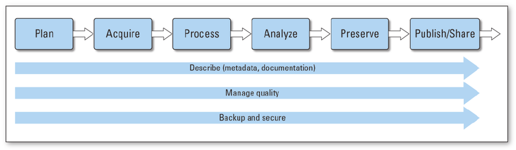{width=100%}

<left>*Source: Faundeen et al 2013, USGS*</left>

As you begin a research project, your data may go through lots of stages in its life cycle. Like the diagram from [Faundeen et al 2013](https://pubs.usgs.gov/of/2013/1265/pdf/of2013-1265.pdf) shows, the first stage starts with **planning** out goals you want to accomplish or research questions you want to answer. Consider the resources (data, funding, personnel) you will need.

With a plan in mind, the second stage of the data life cycle involves identifying and evaluating new or existing data sources to be collected/generated/re-used. You might **acquire** datasets at one of the many data repositories out there. At the next stage, these data inputs will be **processed** through data cleaning and wrangling.

Once the data is processed, it will be ready for **analysis**, where new insights are generated. Be sure to document the processes that were involved, for example, recording the methods and organizing files to ensure that your workflow is reproducible.

As the research project nears its end, consider how you will **preserve** your data products for the long-term, especially if it's required by your funding. If you are planning to submit your data/code for archival at a data repository, plan what metadata and documentation you will need to ensure your results will be accessible and reusable for the future. Each repository will have slightly different requirements, but check out the next few sections to learn more about what data publication at [EDI](https://edirepository.org/) entails.

Last but not least, once your data is **published** with a DOI (digital object identifier), other researchers will be able to use and cite your work in the future, which in turn, will expose your research to an even wider audience.

You may have also noticed three arrows cutting across the diagram. These steps should always be kept in mind when you're progressing your research in order to manage your data effectively. 

As you're working, *describe* your data products by documenting its metadata. Metadata, or data about data, is a critical component of data reusability. More on metadata below. Additionally, have some *quality control* techniques in place so that the values of your output are expected. This helps to ensure that your workflow will run as intended. Finally, it never hurts to *backup* your data regularly to protect it from unexpected data losses due to software failures or natural disasters. 

## Metadata

As mentioned, metadata plays an important role in the data life cycle, yet it's often overlooked. Metadata is crucial to understanding, interpreting, and reusing datasets. It contains information on what was measured, who made the measurements, when and where were measurements made, and why was the data collected. The point is to have enough metadata so that anyone (even you) can reuse the data far into the future. 

If you are submitting your dataset/code to a data repository, you will need to create metadata that documents all the details about the data itself. One popular, standard format for metadata files in the field of environmental sciences is [EML](https://eml.ecoinformatics.org/), Ecological Metadata Language. This format arranges the metadata into an organized, machine-readable set of elements.

There are many ways to create this EML file, such as programmatically through R or by filling out a web form offered by a data repository. EDI is one data repository that has the web form option for researchers to generate their metadata file. 

## EDI Guide 

### Starting your submission

[EDI](https://edirepository.org/), or the Environmental Data Initiative, is a [DataONE](https://www.dataone.org/) data repository that hosts ecological and environmental data for the long-term. They have staff to support curation efforts and work closely with the [LTER Network](https://lternet.edu/) to promote best practices for [FAIR](https://www.go-fair.org/fair-principles/) (Findable, Accessible, Interoperable, and Reusable) data. 

To get started with your data package submission, navigate to the [**Publish Data**](https://edirepository.org/data/publish-data) page in EDI. Like their webpage states, if you want to learn more about the whole data submission process from preparation to publication, feel free to check out their [**resources for data authors**](https://edirepository.org/resources/resources-for-data-authors) page.

Click **Login** under "For Authors" to login to their ezEML metadata editor. ezEML is EDI's easy-to-use web-based tool for creating metadata. 

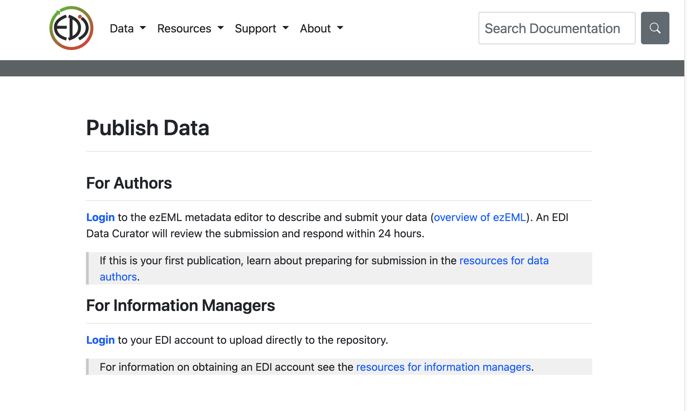{width=100%}

Choose one of the many options to login to ezEML. **You will want to stay consistent with the account that you're using to login because your submissions will only be associated to the account you used to login**. 

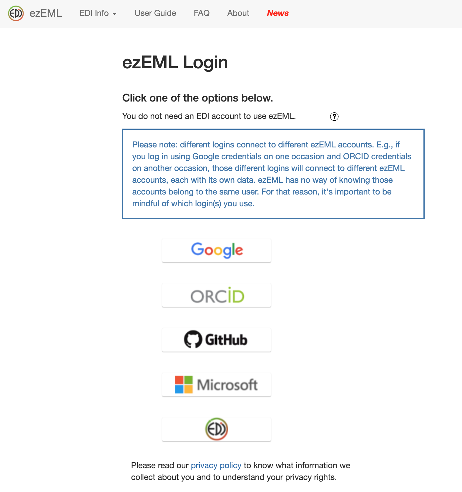{width=100%}

Once you've logged in, click on **EML Documents** then **New...** to start a new EML document. 

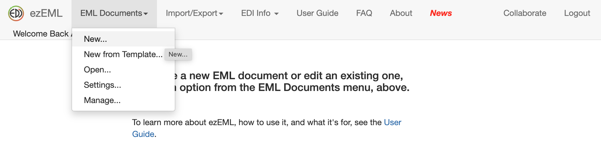{width=100%}

You will be prompted to enter a name for your metadata document. Enter a unique, memorable name that will let you remember what this submission is for.

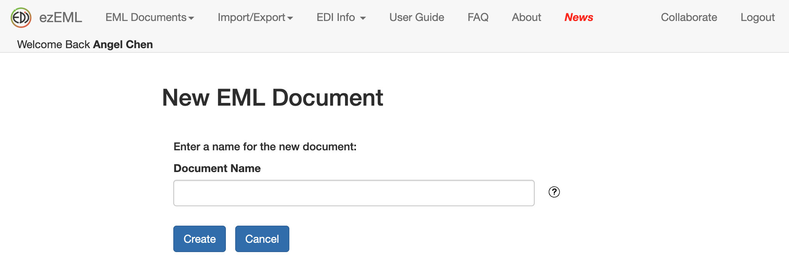{width=100%}

### Filling out metadata

Then you will be presented with a form to fill out all the information about your data, such as the Title, Data Tables, Creators, Contacts, etc. Be as descriptive as you can. Don't worry about filling it all out in one sitting. You can save the information you enter on each page by clicking **Save and Continue**. If you want to reset your edits to the last saved state, click **Reset Changes**.

If you close the browser tab, you can always return to your metadata document to continue where you left off by logging in and selecting **EML Documents** --> **Open...** and then clicking on the document you were working on.

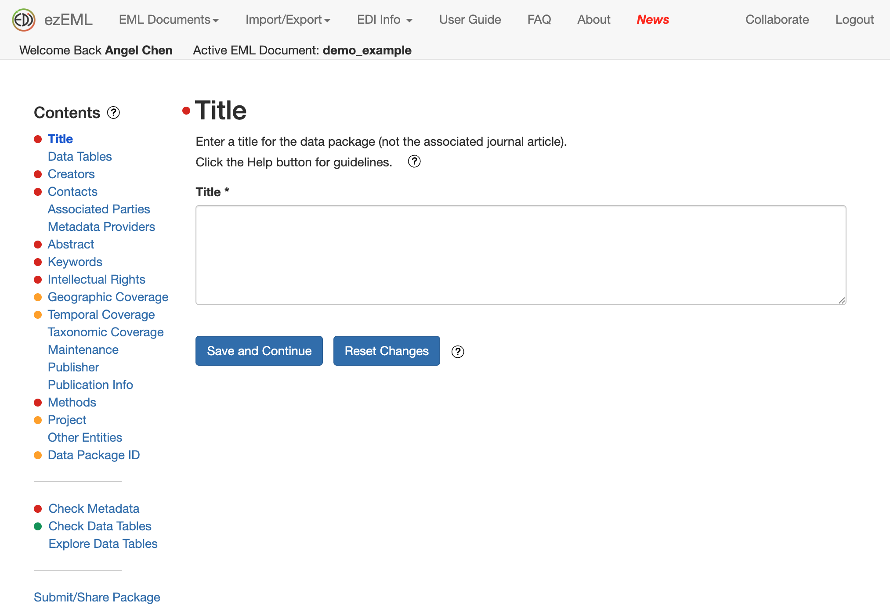{width=100%}

If you're not sure how to fill out a section, click on the question mark to get helpful tips. These tips will guide you on how to best describe the contents for each section.

{width=100%}

In the screenshot below, a pop-up appeared on how to best come up with a Title for your data package. If you are unfamiliar with preparing a dataset for archival, it's highly recommended to read the tips.

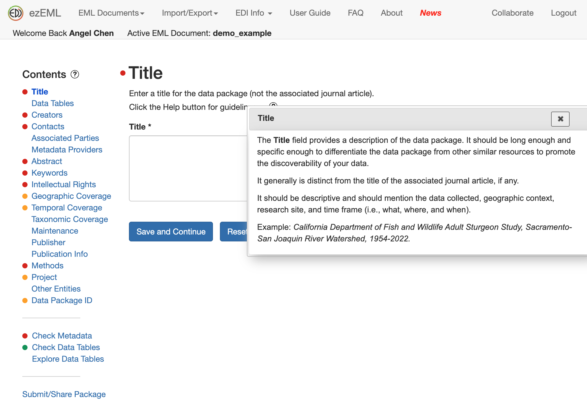{width=100%}

If you have tabular data in CSV files, you can upload them in **Data Tables** by selecting **Load Data Table from CSV File** and EDI will automatically infer many attributes about your data, like column names, so you can save some time on manually filling out information. 

{width=100%}

Here is how the page looks like when you click **Load Data Table from CSV File**. Choose which CSV file to upload.

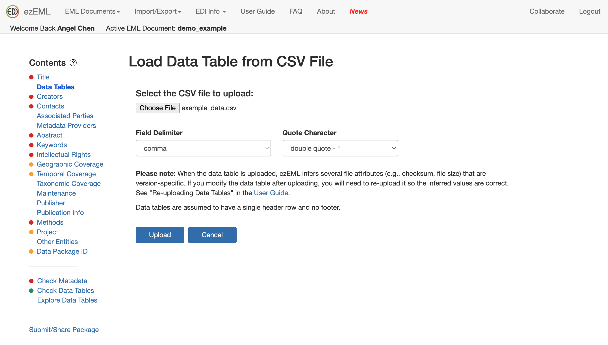{width=100%}

After you upload your CSV file, be sure to double-check the metadata so everything looks correct. Then you can start filling out the rest of the metadata, like the **Description** of the file.

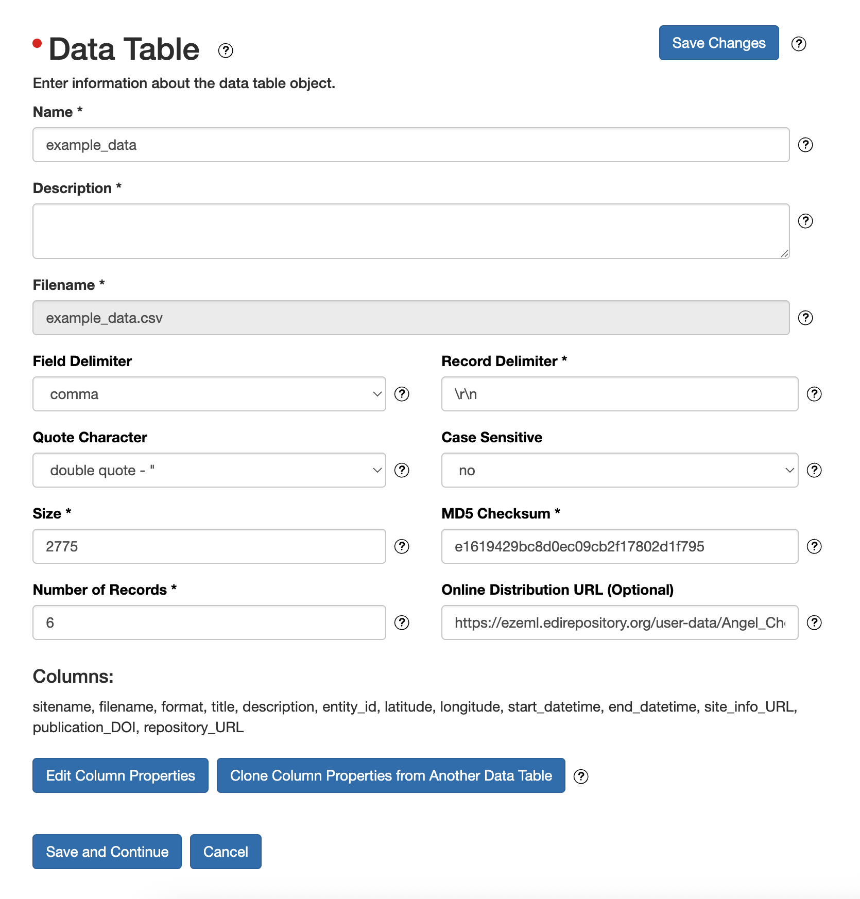{width=100%}

You may also notice a button to **Edit Column Properties**. Clicking on it will lead to a page where you can edit the properties of each column. Select **Edit Properties** to edit the column name, definition, unit, and missing value code. Select **Change Type** to edit the column type.

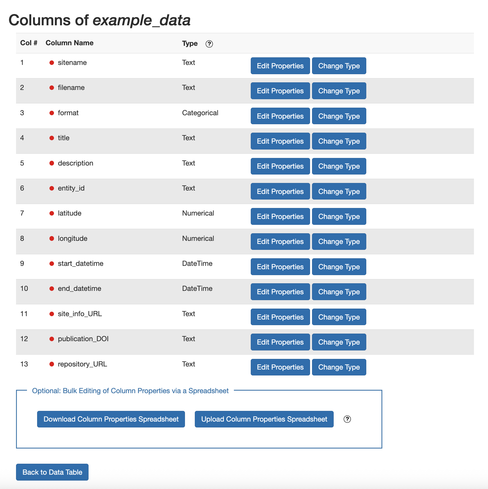{width=100%}

For all other types of data or files (.tif, .txt, .pdf, for example), you can upload them in **Other Entities** by selecting **Load Other Entity from File**. 

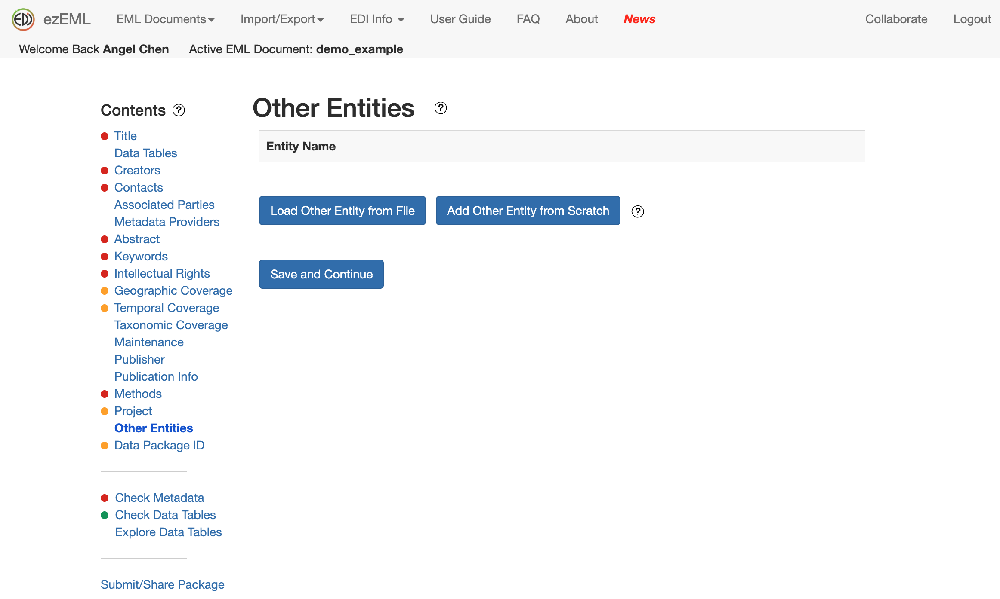{width=100%}

Upload the file of your choice.

{width=100%}

After it has been uploaded, remember to fill out the **Description** of the file.

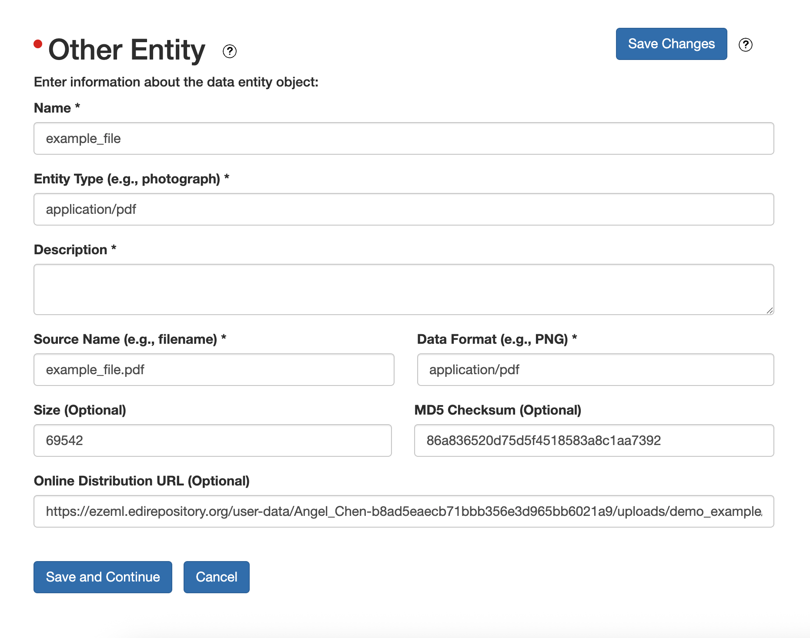{width=100%}

To check on your overall progress, go to **Check Metadata** and see what metadata fields you're still missing. 

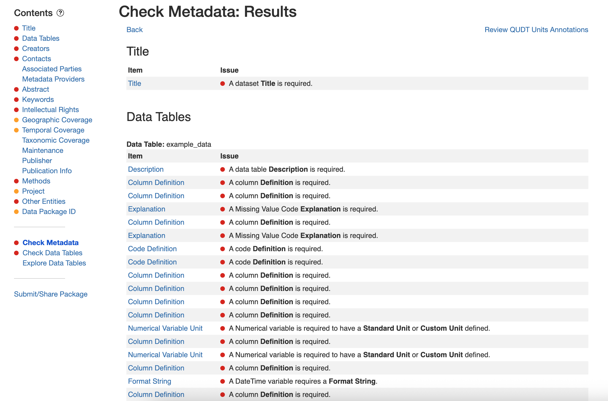{width=100%}

For extra help, check out the [ezEML User Guide](https://ezeml.edirepository.org/eml/user_guide) or [email EDI for support](https://edirepository.org/support/contact-us). You can also watch their YouTube tutorial below. 

<iframe width="800" height="450" src="https://www.youtube.com/embed/T2lhEBWzIPQ?si=ljlsFHtQvZ7bqAIb" title="YouTube video player" frameborder="0" allow="accelerometer; autoplay; clipboard-write; encrypted-media; gyroscope; picture-in-picture; web-share" referrerpolicy="strict-origin-when-cross-origin" allowfullscreen>

</iframe>

### Collaborating on a submission

EDI allows you to collaborate with others on the same data package submission. Be aware that only one person can edit the metadata at a time, though. 

To get started you can either click on **Submit/Share Package** --> **Collaborate with Colleagues**, or click on **Collaborate** in the top right corner next to **Logout**.  

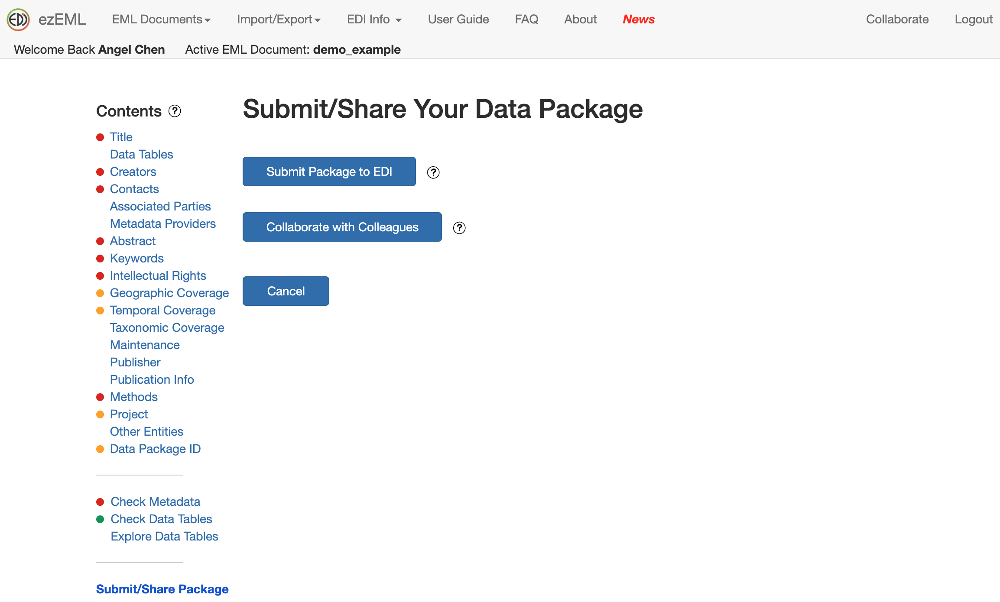{width=100%}

Then you'll get directed to a page where you can click **Invite a Collaborator** and fill out the details to send them an email invitation.

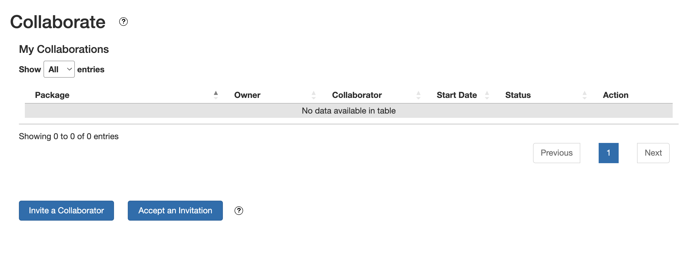{width=100%}

Your collaborator needs to check their email and follow the directions to gain access to the submission. After they finish their edits, they must click **EML Documents** --> **Close** to close their session, thereby allowing you to open the document back up again. This step is necessary because EDI only allows one person to edit at a time. Whenever one of you is done editing, remember to close the document so that the other person/people can regain access!

### Submitting your data package

Once you're done filling out the sections to the best of your ability, you can go to **Import/Export** --> **Preview Your Metadata in the EDI Data Portal...** to generate a full preview of what your data package page will look like. Make sure that everything looks correct before submitting.  

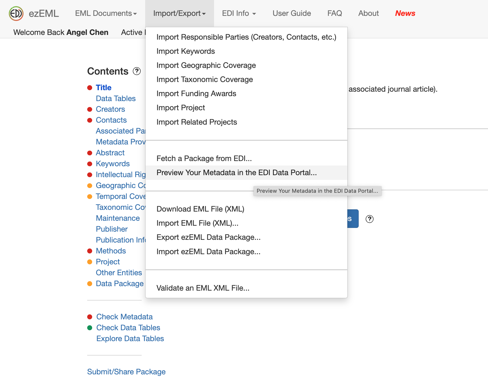{width=100%}

Whenever you're ready, click on **Submit/Share Package** --> **Submit Package to EDI** to submit your data package for the EDI team to review. 

{width=100%}

#### Embargos

When you're submitting for review, there's an option to add a message to your submission. 

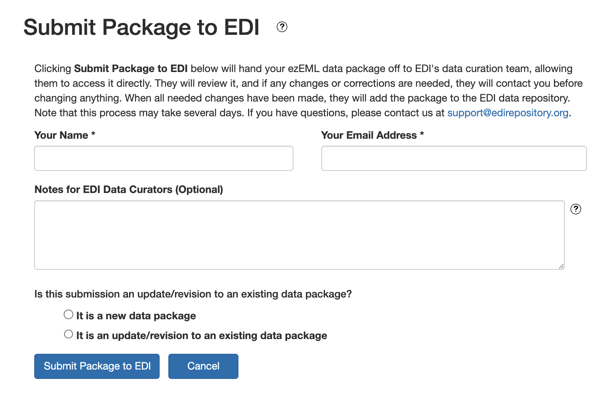{width=100%}

If you wish for your data to be embargoed until the manuscript associated with it is published, you should mention it there. The EDI team will handle the embargo for you and make the data files inaccessible to the public, but still issue your data package a DOI. So you can put the data package DOI in your manuscript or give it to the journal, wait until your paper is published, and then email the EDI staff to lift the embargo. In your subsequent email, be sure to mention that your paper is now published, so that the EDI team can add the journal citation to your data package landing page. Then your data and paper can be connected!

There's also an option to embargo your data files but allow anonymous reviewer access. This means that the general public cannot access your data, but you and the journal reviewers can. If this interests you, mention it in the notes during submission so that the EDI curators can issue you a special link that can access the whole data package (metadata and data files included). You would need to then pass that special link to the journal editors so that they can give reviewers access. Of course, the curators will also issue your data package a DOI during this process. 

In general, after your submission, the EDI team will respond back to you via email with any additional suggestions/edits or the greenlight to publish your data package with a DOI if everything looks good. Be sure to check your inbox to ensure that you can respond back to them in a timely manner!

### After publication

When your data is published with a DOI, the landing page for your data package may look something like [this](https://doi.org/10.6073/pasta/ae3ef7402b347a7b9ec92bbf8b314685):

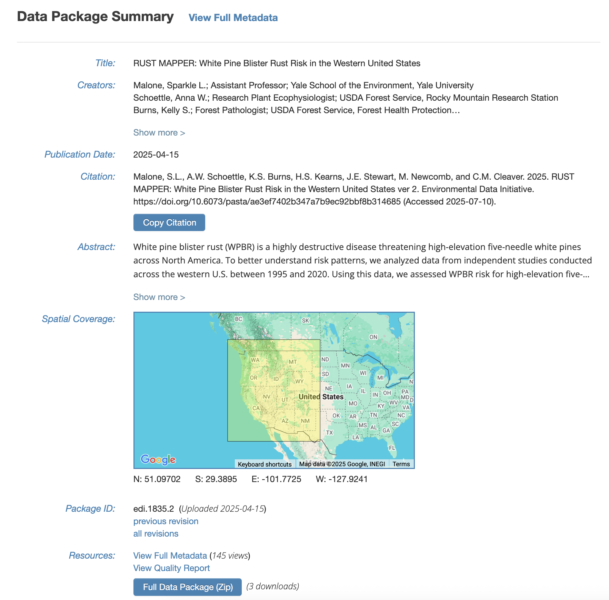{width=100%}

The full metadata will be available under **View Full Metadata**. With this, your data will be available for reuse!
