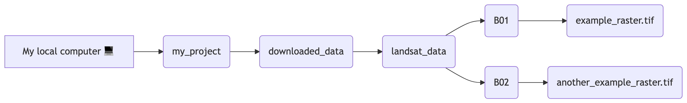
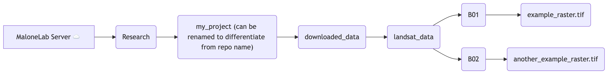

- In general, file paths should be saved to its own variables near the top of the script, or marked clearly somewhere so that users can easily change paths if needed
- If you're consistently reusing the same base folders, you can save them in their own respective variables near the top of the script and just add on the inner folders/files as needed with the `file.path()` function in R or the `pathlib` module in Python.
   - This will be helpful if you're constantly switching between your local files and the files on the MaloneLab Server (more on that below)

## Local Paths

:::{.panel-tabset}

### R

Imagine your GitHub repo is named `my_project`. If you've followed the setup instructions, you should have cloned the repo to your local computer via Rprojects. In RStudio, once you open the .Rproj file associated with your local Git repo, your current working directory will automatically be set to the project directory. Thus, you can immediately start using relative file paths instead of specifying your paths beginning from the root directory.

For example, let's say that we have a folder in `my_project` that holds our downloaded data called `downloaded_data`. Then inside, there's a `landsat_data` folder that has—you guessed it—our Landsat data. For now, we have Landsat bands 1 and 2 downloaded as .tif files under the `B01` and `B02` folders, and our folder structure looks like this:

{width=100%}

Since our current working directory is automatically set to the `my_project` folder, we can use relative file paths and read in our local files like so:

```{r}
#| eval: false

library(terra)

# Point to Landsat folder
landsat_path <- file.path("downloaded_data", "landsat_data")

# Read in Band 1 raster
band1_raster <- terra::rast(file.path(landsat_path, "B01", "example_raster.tif"))

# Read in Band 2 raster
band2_raster <- terra::rast(file.path(landsat_path, "B02", "another_example_raster.tif"))
```

### Python

Imagine your GitHub repo is named `my_project`. If you've followed the setup instructions, you should have cloned the repo to your local computer via the VS Code GUI or GitHub Desktop. In VS Code or your preferred Python IDE, once you open the folder associated with your local Git repo, your current working directory will automatically be set to the project directory. Thus, you can immediately start using relative file paths instead of specifying your paths beginning from the root directory.

For example, let's say that we have a folder in `my_project` that holds our downloaded data called `downloaded_data`. Then inside, there's a `landsat_data` folder that has—you guessed it—our Landsat data. For now, we have Landsat bands 1 and 2 downloaded as .tif files under the `B01` and `B02` folders, and our folder structure looks like this:

{width=100%}

Since our current working directory is automatically set to the `my_project` folder, we can use relative file paths and read in our local files like so:

```
import rasterio
from pathlib import Path

# Point to Landsat folder
landsat_path = Path("downloaded_data", "landsat_data")

# Read in Band 1 raster
band1_raster = rasterio.open(landsat_path.joinpath("B01", "example_raster.tif"))

# Read in Band 2 raster
band2_raster = rasterio.open(landsat_path.joinpath("B02", "another_example_raster.tif"))

# Close them when you're done
band1_raster.close()
band2_raster.close()
```

:::

Notice how we did not need to use any forward or backward slashes at all. If someone cloned your repo and put the data files in the right folders, they would not need to change the file paths in your script at all, regardless of what operating system they use.

## Server Paths
:::{.callout-warning}
If you're working on a Windows computer, be sure to use `corellia.environment.yale.edu` instead of `Volumes` in your file paths!
:::

Now what if your research is at the stage where you would like other lab members to run your workflow, but maybe you don't necessarily want them to re-download the entire dataset since it takes a long time? You can create a folder on the MaloneLab Server for your project with the same inner folder structure. Below is an example of how your folders can look like in the server. Then either move or copy your data files here.

{width=100%}

Now everyone in the lab has access to these files.

:::{.panel-tabset}

### R

Your working directory is most likely still set to your local computer. 

So one way to point to server paths in R is to use the absolute file paths, which can look like this:
```{r}
#| eval: false
# On Mac:
landsat_path <- "/Volumes/MaloneLab/Research/my_project/downloaded_data/landsat_data"

# Or on Windows:
landsat_path <- "//corellia.environment.yale.edu/MaloneLab/Research/my_project/downloaded_data/landsat_data"
```
but alternatively, we can also use `file.path()` as good practice and to easily add on our inner folders/files.

In that case, we can adjust our scripts to read in server files like so:

```{r}
#| eval: false

library(terra)

# Point to Landsat folder
# If you're using a Windows computer, use "corellia.environment.yale.edu" instead of "Volumes"
landsat_path <- file.path("/", "Volumes", "MaloneLab", "Research", "my_project", "downloaded_data", "landsat_data")

# Read in Band 1 raster
band1_raster <- terra::rast(file.path(landsat_path, "B01", "example_raster.tif"))

# Read in Band 2 raster
band2_raster <- terra::rast(file.path(landsat_path, "B02", "another_example_raster.tif"))
```

If you want to easily switch between your local computer and the MaloneLab Server, you can even leave in both options and allow yourself or whoever is running your script to decide by commenting out whichever path they're not using.

```{r}
#| eval: false

# Leave in both the local and server paths and let the user decide

# Comment this out if using the server files
landsat_path <- file.path("downloaded_data", "landsat_data")

# Comment this out if using the local files
# If you're using a Windows computer, use "corellia.environment.yale.edu" instead of "Volumes"
landsat_path <- file.path("/", "Volumes", "MaloneLab", "Research", "my_project", "downloaded_data", "landsat_data")
```

### Python

Your working directory is most likely still set to your local computer. 

So one way to point to server paths in R is to use the absolute file paths, which can look like this:
```
# On Mac:
landsat_path = "/Volumes/MaloneLab/Research/my_project/downloaded_data/landsat_data"

# Or on Windows:
landsat_path = "//corellia.environment.yale.edu/MaloneLab/Research/my_project/downloaded_data/landsat_data"
```
but alternatively, we can also use the `pathlib` module as good practice and to easily add on our inner folders/files.

In that case, we can adjust our scripts to read in server files like so:

```
import rasterio
from pathlib import Path

# Point to Landsat folder
# If you're using a Windows computer, use "corellia.environment.yale.edu" instead of "Volumes"
landsat_path = Path("/", "Volumes", "MaloneLab", "Research", "my_project", "downloaded_data", "landsat_data")

# Read in Band 1 raster
band1_raster = rasterio.open(landsat_path.joinpath("B01", "example_raster.tif"))

# Read in Band 2 raster
band2_raster = rasterio.open(landsat_path.joinpath("B02", "another_example_raster.tif"))

# Close them when you're done
band1_raster.close()
band2_raster.close()
```

If you want to easily switch between your local computer and the MaloneLab Server, you can even leave in both options and allow yourself or whoever is running your script to decide by commenting out whichever path they're not using.

```
# Leave in both the local and server paths and let the user decide

# Comment this out if using the server files
landsat_path = Path("downloaded_data", "landsat_data")

# Comment this out if using the local files
# If you're using a Windows computer, use "corellia.environment.yale.edu" instead of "Volumes"
landsat_path = Path("/", "Volumes", "MaloneLab", "Research", "my_project", "downloaded_data", "landsat_data")
```
:::

Since the inner folder structure is the same between your local computer and the server, there's no need to go into your scripts and manually change the paths that build off of the base folders. 

There may be other scenarios where you may use a mix of local and server file paths in the same script. It's worth the time to plan ahead and organize your folders accordingly!

:::callout-note
These tips are not rules you must absolutely follow, but rather guidelines meant to help increase the reproducibility of your scripts by lessening the burden for whoever wants to rerun your work in the future (yes, that can even include future-you rerunning your own research on a different machine!)
:::