The MaloneLab Server is a cloud storage location owned by YSE. All members of the lab should have access to this location to store large data files. The steps to access the server are as follows:

:::{.panel-tabset}

### Mac

#### 1️⃣ Contact the YSE IT team for access

Email the YSE IT team at ysehelpdesk\@yale.edu to ask for access to **corellia.environment.yale.edu/malonelab** if Sparkle has not already asked for access. 

#### 2️⃣ Make sure you're connected to Yale network or use the VPN

Connection to the server requires that your computer use the Yale on-campus networks (such as ethernet or one of the Yale Wifi networks). If you're not on-campus, you may use the Yale VPN to route your traffic through Yale.

To use the Yale VPN, you will need the Cisco Secure Client VPN software. All Yale-managed computers should automatically have this software installed, but if you need Cisco Secure Client on a personal computer, visit this [Yale IT Services walkthrough](https://yale.service-now.com/kb?id=kb_article_view&sysparm_article=KB0000326) to see where to download the Cisco Secure Client.

Once you have Cisco Secure Client, simply open it up, and type "access.yale.edu" as the address. Click "**Connect**"

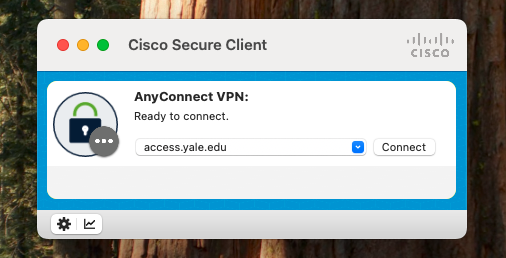{width=80%}

You might need to log in with your Yale email, NetID password, and do your two-factor authentication. After logging in, you will see this message:

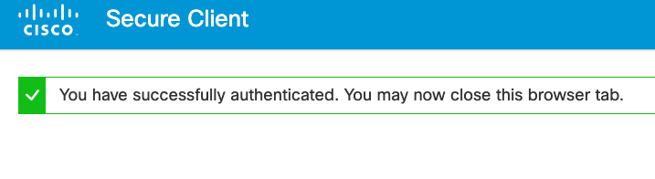{width=100%}

#### 3️⃣ Connect to server

Once you're connected to the VPN, click "**Go**" at the top of your Mac screen. Then click "**Connect to Server...**".

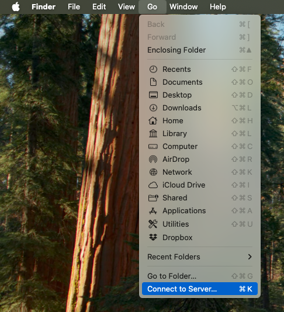{width=80%}

Type in "smb://corellia.environment.yale.edu/malonelab" in the address bar and click "**Connect**".

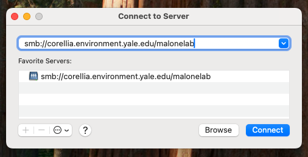{width=80%}

And you should now be connected to the server! Research projects typically live under the "Research" folder.

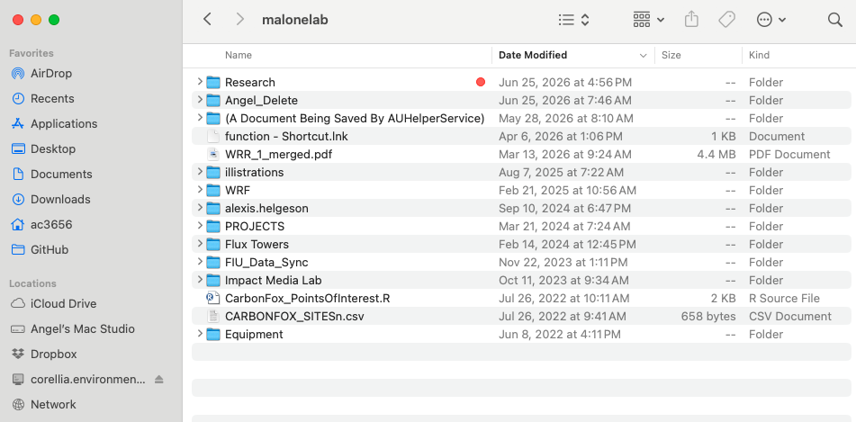{width=100%}

This icon will appear on your desktop as long as you're connected to the server.

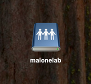{width=40%}

#### 4️⃣ Use the right file paths

Absolute file paths in the server will begin like: 

```
//Volumes/MaloneLab/Research/...
```

If you have a `my_project` folder under `Research`, you can access it with R like so:

```
server_folder <- file.path("/", "Volumes", "MaloneLab", "Research", "my_project")
```

Or with Python:

```
from pathlib import Path
server_folder = Path("/", "Volumes", "MaloneLab", "Research", "my_project")
```

### Windows

#### 1️⃣ Contact the YSE IT team for access

Email the YSE IT team at ysehelpdesk\@yale.edu to ask for access to **corellia.environment.yale.edu/malonelab** if Sparkle has not already asked for access. 

#### 2️⃣ Make sure you're connected to Yale network or use the VPN

Connection to the server requires that your computer use the Yale on-campus networks (such as ethernet or one of the Yale Wifi networks). If you're not on-campus, you may use the Yale VPN to route your traffic through Yale.

To use the Yale VPN, you will need the Cisco Secure Client VPN software. All Yale-managed computers should automatically have this software installed, but if you need Cisco Secure Client on a personal computer, visit this [Yale IT Services walkthrough](https://yale.service-now.com/kb?id=kb_article_view&sysparm_article=KB0000326) to see where to download the Cisco Secure Client.

Once you have Cisco Secure Client, simply open it up, and type "access.yale.edu" as the address. Click "**Connect**"

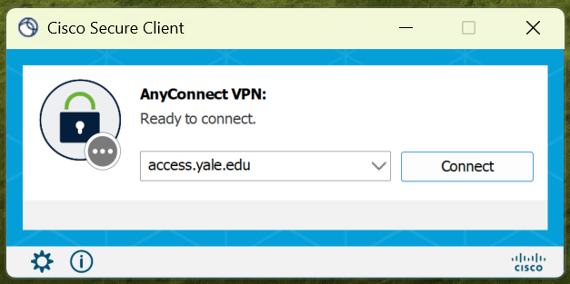{width=80%}

You might need to log in with your Yale email, NetID password, and do your two-factor authentication. After logging in, you will see this message:

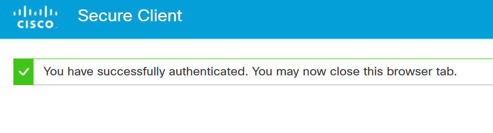{width=100%}

#### 3️⃣ Connect to server

Once you're connected to the VPN, search for "**Run**" at Windows search bar and click to open the program.

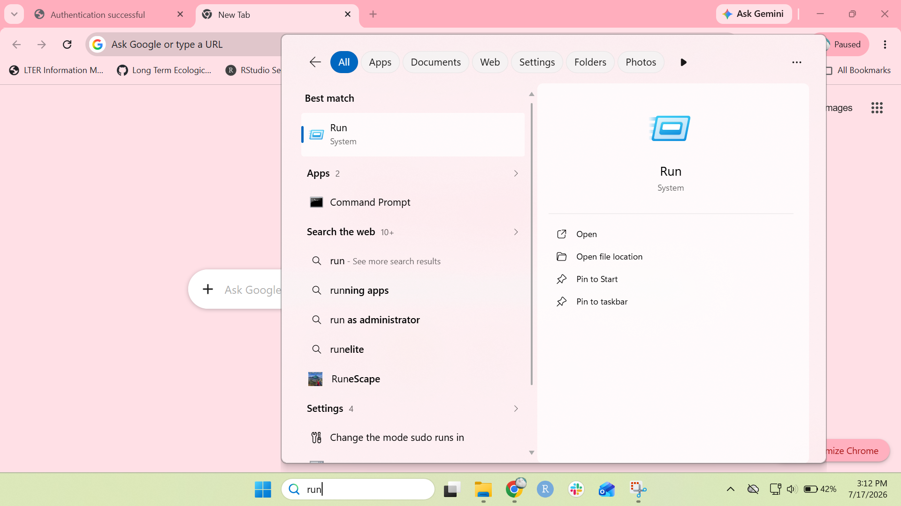{width=80%}


Type in "\\\\corellia.environment.yale.edu\\malonelab" in the address bar and click "**Connect**".

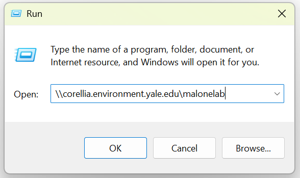{width=80%}

And you should now be connected to the server! Research projects typically live under the "Research" folder.

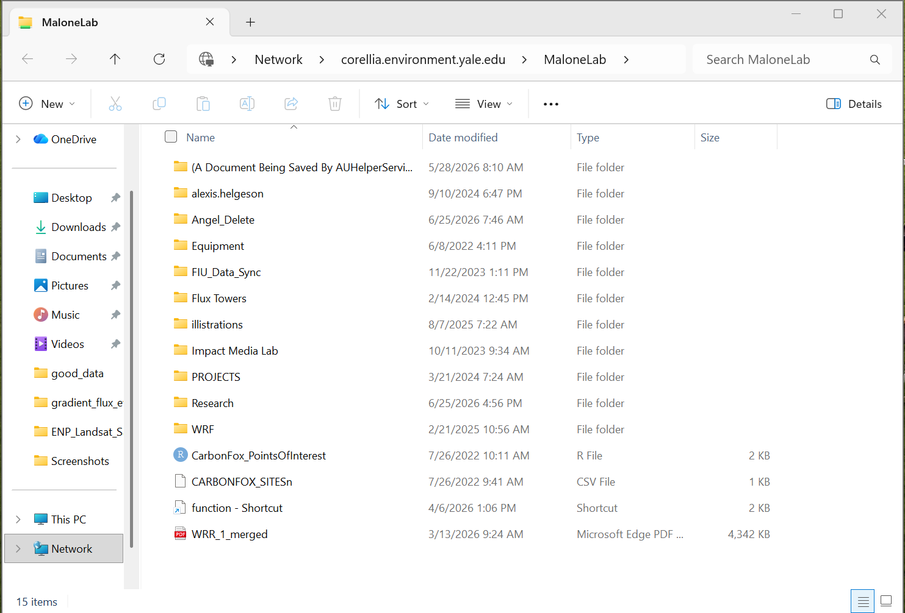{width=100%}

#### 4️⃣ Use the right file paths

Absolute file paths in the server will begin like: 

```
\\corellia.environment.yale.edu\MaloneLab\Research\...
```

If you have a `my_project` folder under `Research`, you can access it with R like so:

```
server_folder <- file.path("/", "corellia.environment.yale.edu", "MaloneLab", "Research", "my_project")
```

Or with Python:

```
from pathlib import Path
server_folder = Path("/", "corellia.environment.yale.edu", "MaloneLab", "Research", "my_project")
```

:::

:::callout-note
It's best to avoid typing file paths with "/" or "\\" because this can differ between operating systems, but this is unavoidable with MaloneLab Server paths. If you must use slashes in your code, use the forward slash "/", as this will work on both Mac and Windows.

For more tips on file paths, please check out ...
:::